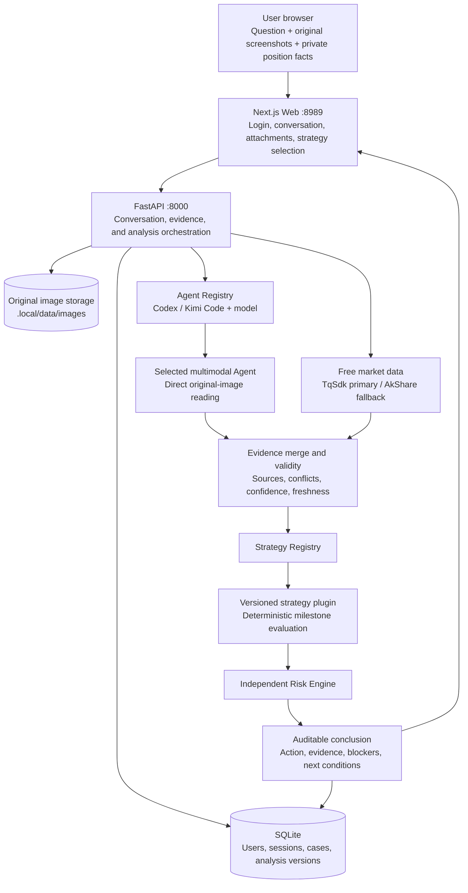

[中文](README.md) | **English**

# Panshi Trading AI

Multimodal, auditable strategy analysis for China's futures market.

## Product positioning

Panshi Trading AI is a desktop analysis and decision-support system. In a
continuous conversation, a user can submit a question and complete market
screenshots. The system performs:

- selectable Codex or Kimi Code multimodal analysis of the original image;
- public market-data enrichment through TqSdk and AkShare;
- data consistency and validity checks;
- versioned deterministic strategy evaluation;
- independent risk validation;
- a final action aligned with every strategy milestone;
- auditable disclosure of evidence, milestones, and blockers;
- follow-up explanation of conclusions, rules, evidence, and risk controls.

The product does not ask a language model to guess market direction from a
chart. It combines multimodal evidence, public data, deterministic strategy
logic, independent risk controls, and an inspectable user experience.

> **Safety boundary:** this release provides analysis and decision support only.
> Keep `TRADING_AGENT_ENABLE_ORDER_EXECUTION=false`. It does not connect to a live order gateway
> and does not replace licensed advice, exchange rules, or the operator's own risk controls.

## Highlights

### Direct original-image understanding

The runtime sends the complete user screenshot directly to the Codex or Kimi
Code model selected for the case. OpenCV, image slicing, local OCR, and coordinate
reconstruction are not used as substitutes in the production evidence path.
Contract, timeframe, candles, indicators, and surrounding UI context remain
available to the model. Codex defaults to `gpt-5.6-sol`; Kimi Code defaults to
`kimi-k3`, displayed as `Kimi 3`.

The Agent and model are pinned to the case and are used consistently for
vision, clarification, and follow-up answers. The system does not silently
fall back to another Agent. It reports the unavailable reason and requires an
explicit user switch.

### Automatic public-data enrichment

The system derives prices, volume, open interest, trading dates, and indicator
inputs from the screenshot, TqSdk, AkShare, and exchange daily data. It asks
the user only for private facts such as actual position details, account risk
limits, or a genuine conflict about the screenshot's target.

### Strategy and risk control the final action

The language model extracts, summarizes, and explains evidence, but **cannot independently decide**
the final action. A deterministic strategy plugin emits the candidate action,
and the independent Risk Engine can veto any signal.

### Every core step is auditable

Each analysis records the strategy ID and version, milestone inputs, rule
comparisons, screenshot evidence, public-market evidence, field provenance,
model version, confidence, blockers, and next trigger conditions. The product
shows verifiable execution records rather than hidden model reasoning.

### Strategies are decoupled from the application

The Web, conversation, data, authentication, and risk layers do not hard-code
one strategy. A **Strategy Registry** loads and pins versioned plugins. The
default plugin is `Structure Confirmation Strategy v1.0.0`; future strategies
can be installed, upgraded, disabled, and rolled back independently.

## Logical architecture



### Component responsibilities

| Component | Responsibility |
| --- | --- |
| Next.js Web | SQLite login, continuous conversation, screenshot attachments, strategy selection, and history |
| FastAPI | API authentication, original-image storage, case state, orchestration, and session management |
| SQLite | Password hashes, session digests, case events, and analysis versions |
| Agent Registry | Lists Codex, Kimi Code, and model capabilities and pins the selection to each case |
| Codex / Kimi Code | Reads original images and emits structured observations, visible text, confidence, and uncertainty |
| TqSdk / AkShare | China-futures public data; TqSdk is optional and AkShare is the automatic fallback |
| Evidence layer | Merges screenshots and structured data and detects conflicts, missing fields, close status, and quality |
| Strategy Registry | Discovers, selects, and pins strategy plugin versions |
| Strategy plugin | Produces milestones and candidate actions from explicit rules |
| Risk Engine | Checks risk budget, stop distance, and correlated exposure and can veto an action |
| Conversation layer | Renders immutable strategy output and answers follow-up questions |

### Screenshot-to-decision flow

```text
User question and complete original screenshots
  -> select Codex or Kimi Code and a model
  -> direct multimodal extraction through the selected Agent
  -> TqSdk / AkShare public-market enrichment
  -> evidence merge, provenance, and data-validity evaluation
  -> select and pin strategy ID and version
  -> execute deterministic strategy milestones
  -> validate or veto through the independent Risk Engine
  -> generate a final action aligned with every milestone
  -> store a new analysis version and continue the conversation
```

## Default deployment mode

The recommended path is the Docker-free local lightweight runtime:

```text
Browser -> Next.js :8989 -> FastAPI :8000
                              |-> SQLite
                              |-> original-image directory
                              |-> Codex CLI / Kimi Code ACP
                              `-> inline strategy analysis
```

Only Next.js and FastAPI run as long-lived processes. PostgreSQL, Redis, MinIO,
Temporal, a separate worker, and an OTel Collector are not required.

## Installation

### 1. Requirements

- macOS or Linux;
- Python 3.10 or newer;
- Node.js 20 or newer;
- npm and Git;
- an executable Codex CLI;
- an optional Kimi Code CLI;
- a model-provider API key available through an environment variable;
- free local ports `8000` and `8989`.

Check the required commands:

```sh
python3 --version
node --version
npm --version
git --version
codex --version
kimi --version
```

### 2. Clone the repository

The public repository can be cloned without signing in:

```sh
git clone https://github.com/IFOSR/panshi-trading-ai.git
cd panshi-trading-ai
```

GitHub CLI is also supported:

```sh
gh repo clone IFOSR/panshi-trading-ai
cd panshi-trading-ai
```

### 3. Configure Agents and models

Codex is the primary multimodal provider. Initialization reads
`CODE_CLI_API_KEY` from the current shell:

```sh
export CODE_CLI_API_KEY=<your-code-cli-api-key>
codex --version
```

Never place a real key in the README, Git, `.env.example`, or a startup script.
Initialization writes the credential to the private mode-`0600` `.local/env`.

For another compatible provider, update the initialized environment:

```sh
TRADING_AGENT_CODEX_MODEL_PROVIDER=code-cli
TRADING_AGENT_CODEX_PROVIDER_BASE_URL=https://your-provider.example/v1
TRADING_AGENT_CODEX_PROVIDER_ENV_KEY=CODE_CLI_API_KEY
CODE_CLI_API_KEY=<your-code-cli-api-key>
```

Codex defaults to `gpt-5.6-sol`. Kimi Code is optional. The application does
not install, upgrade, or rewrite Kimi Code and never modifies
`~/.kimi-code/config.toml`. To enable Kimi, first verify the existing install:

```sh
kimi --version
kimi doctor
```

Kimi Code must expose the `kimi-k3` alias with `image_in` in that model's
capabilities. The UI displays it as `Kimi 3`. It also lists
`kimi-code/kimi-for-coding`, but that alias is enabled for screenshot analysis
only when it also declares `image_in`. The model must also pass ACP
initialization and session creation so the existing authentication is
verified. A missing CLI, alias, image capability, or ACP authentication leaves
the model visible but disabled with an exact reason.

Kimi runs through `kimi -m <model> acp`. Original image bytes are sent as ACP
image blocks and every tool permission request is denied. The application
only reads the existing Kimi login and model configuration and does not upgrade or rewrite Kimi Code.

### 4. Initialize

Run from the repository root:

```sh
./bin/trading-agent-local init
./bin/trading-agent-local doctor
```

`init` creates the Python environment, installs dependencies, builds the Web
application, generates local settings, initializes SQLite, and checks Agent,
model, and market-data dependencies. Codex is required; Kimi Code is optional
and does not block startup when unconfigured. Important local paths are:

```text
.local/env                         private runtime configuration and secrets
.local/venv/                       Python virtual environment
.local/data/trading-agent.db       SQLite database
.local/data/images/                original user screenshots
.local/logs/api.log                FastAPI log
.local/logs/web.log                Next.js log
.local/run/                        PIDs and process metadata
```

`.local` is ignored by Git. Never commit its contents.

### 5. Create a login account

Accounts and password hashes live in SQLite rather than source code or
environment variables. Load the database URL:

```sh
set -a
. .local/env
set +a
```

Create an account or change its password interactively:

```sh
.local/venv/bin/panshi-user set-password <username>
```

The command prompts twice without echoing the password. Automation can provide
one password through standard input:

```sh
printf '%s\n' '<password>' \
  | .local/venv/bin/panshi-user set-password <username> --password-stdin
```

Do not put a real password in a command-line argument, `.local/env`, a script,
or Git.

### 6. Configure free China-futures data

Local mode defaults to:

```sh
TRADING_AGENT_MARKET_DATA_PROVIDER=free
```

- TqSdk is the primary source when a free Kuaiqi account is configured;
- the runtime performs an automatic **AkShare fallback** when TqSdk is absent
  or unavailable;
- closed daily bars can be checked against exchange daily reports;
- provider provenance and quality warnings appear in the data-validity step.

To enable TqSdk, edit `.local/env`:

```sh
TRADING_AGENT_TQSDK_USERNAME=<your-free-tq-account>
TRADING_AGENT_TQSDK_PASSWORD=<your-free-tq-password>
```

The system still runs through AkShare when these fields are empty. Market-data
credentials remain on the backend and are never sent to the browser.

### 7. Confirm the safety setting

Keep this value in `.local/env`:

```sh
TRADING_AGENT_ENABLE_ORDER_EXECUTION=false
```

Do not change it to `true` in this release.

### 8. Start the services

```sh
./trading-agent.sh start
```

Open:

- Web: `http://127.0.0.1:8989`
- API documentation: `http://127.0.0.1:8000/docs`

Check runtime status:

```sh
./bin/trading-agent-local status
```

## User workflow

1. Sign in with a SQLite account.
2. Select a strategy, Agent, and model, then enter an analysis question.
3. Attach one or two complete screenshots containing the contract, timeframe,
   and full chart context.
4. The system sends the originals to the selected Agent and enriches public market data.
5. The conversation displays data validity, strategy milestones, risk
   constraints, and the final action.
6. Ask follow-up questions about the conclusion, rules, evidence, or risk.
7. Only genuine ambiguity that remains after image and public-data analysis
   enters a clarification dialogue.
8. New evidence creates a new analysis version without mutating the original.

## Daily operations

### Start, stop, restart, and status

```sh
./trading-agent.sh start
./trading-agent.sh stop
./trading-agent.sh restart
./bin/trading-agent-local status
./bin/trading-agent-local doctor
```

### Account administration

```sh
set -a
. .local/env
set +a

.local/venv/bin/panshi-user set-password <username>
.local/venv/bin/panshi-user disable <username>
.local/venv/bin/panshi-user enable <username>
```

- `set-password` creates an account or rotates its password and revokes all
  current sessions for that user;
- `disable` deactivates the account and revokes all sessions;
- `enable` reactivates the account but does not restore old sessions;
- browser sessions have a **12-hour** absolute lifetime;
- SQLite stores salted scrypt password hashes and session-token digests.

### Update the application

```sh
./trading-agent.sh stop
git pull --ff-only
export CODE_CLI_API_KEY=<your-code-cli-api-key>
./bin/trading-agent-local init
./bin/trading-agent-local doctor
./trading-agent.sh start
```

## Troubleshooting

### Codex is unavailable

```sh
codex --version
./bin/trading-agent-local doctor
```

Confirm that the current shell contains the provider credential and inspect
the model-provider fields in `.local/env`.

### Kimi Code or Kimi 3 is unavailable

```sh
kimi --version
kimi doctor
./bin/trading-agent-local doctor
```

Confirm that `~/.kimi-code/config.toml` contains `kimi-k3` and that its
capabilities include `image_in`. `kimi-code/kimi-for-coding` also requires
`image_in` before it can be selected. The application does not upgrade or
rewrite Kimi Code and does not silently fall back to Codex. Continue with
Codex or explicitly switch after repairing the Kimi configuration.

### The Web UI is unavailable

```sh
./bin/trading-agent-local status
tail -n 100 .local/logs/web.log
```

Confirm that port `8989` is free and the production Web build exists.

### The API fails to start

```sh
tail -n 100 .local/logs/api.log
./bin/trading-agent-local doctor
```

Confirm that port `8000` is free, the SQLite URL is absolute, and `.local/env`
has the correct permissions.

### Login returns to the login page

Check API status, account state, and whether the session exceeded 12 hours.
Rotate the password with `panshi-user set-password` when necessary.

### TqSdk is unavailable

TqSdk is optional. Check its credentials and restart; without it, the system
should report an **AkShare fallback**. If every public source is unavailable,
the strategy blocks steps that require precise market data instead of asking
the user to re-enter publicly obtainable facts.

## Development and tests

Backend:

```sh
python3 -m venv .venv
. .venv/bin/activate
pip install -e '.[dev]'
pytest -q
ruff check .
mypy src/trading_agent
```

Frontend:

```sh
cd web
npm ci
npm run lint
npm run build
npm run test:e2e
```

See `docs/runbook.md` for the full runtime reference and
`docs/evaluation.md` for multimodal evaluation.
