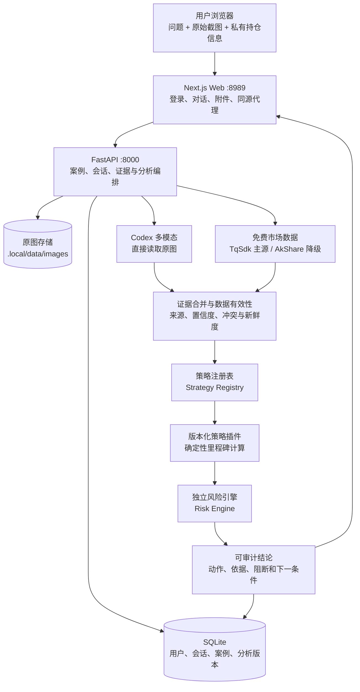
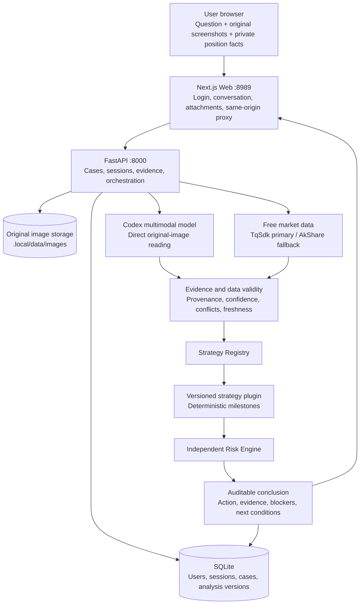

<a id="language"></a>

# Panshi Trading AI / 磐石交易AI

**Multimodal, auditable strategy analysis for China's futures market.**<br>
**面向中国期货市场的多模态、可审计策略分析系统。**

## Language / 语言

[中文](#中文) | [English](#english)

---

<a id="中文"></a>

# 中文

[返回语言选择](#language)

## 磐石交易AI是什么

磐石交易AI是一套面向中国期货市场的桌面端分析与决策支持系统。用户可以在持续
对话中提交问题、完整行情截图和必要的持仓信息，系统会自动完成：

- Codex 原图多模态识别；
- TqSdk / AkShare 公开行情补全；
- 数据一致性与有效性校验；
- 版本化策略插件计算；
- 独立风险约束；
- 最终操作结论生成；
- 每个核心里程碑、证据来源和阻断原因的审计展示；
- 基于原结论的持续追问和必要澄清。

系统的目标不是让大语言模型“看图猜涨跌”，而是把多模态理解、公开数据、确定性
策略、独立风控和可审计交互组合成一条可信的分析链路。

> **安全边界：** 当前版本只提供分析和决策支持，并保持
> `TRADING_AGENT_ENABLE_ORDER_EXECUTION=false`。系统不连接实盘下单网关，
> 不能替代持牌投资顾问、交易所规则或用户自身的风险判断。

## 为什么值得部署

### 1. 直接理解用户原图

运行时把用户上传的完整截图直接交给 Codex 多模态模型。生产证据链不使用
OpenCV、图像切片、本地 OCR 或坐标重建来替代模型理解，因此能保留完整的合约、
周期、K 线、指标和界面上下文。

### 2. 能自动获取的数据不再反复询问用户

系统优先从截图、TqSdk、AkShare 和交易所盘后数据中补充行情、成交量、持仓量、
交易日期和指标输入。只有真实持仓、账户风险限制或截图目标冲突等私有事实才需要
用户通过对话补充。

### 3. 最终动作不由语言模型自由发挥

语言模型负责提取、归纳和解释证据，但**不能独立决定**最终操作。最终动作由
确定性策略插件和独立风险引擎生成；风险否决可以覆盖任何策略信号。

### 4. 用户可以看到策略的关键过程

每次分析都保留：

- 策略 ID、版本和适用市场；
- 每个策略里程碑的实际输入；
- 规则编号、比较结果和状态；
- 截图证据与公开行情证据；
- 字段来源、模型、提示词版本和置信度；
- 当前阻断原因与下一触发条件；
- 新旧分析版本之间的变化。

系统展示的是可验证的策略执行记录，不展示模型隐藏思维过程。

### 5. 对话是主流程，而不是一次性报告

用户在同一会话中可以继续追问结论、规则、证据和风险依据，也可以上传新的截图、
刷新公开行情或确认澄清信息。原结论保持不可变，新证据会产生新的分析版本。

### 6. 策略与产品架构解耦

前端、会话、数据、认证和风控层不写死“八步”或某个具体策略。策略通过
**策略注册表**加载，并固定到精确版本。当前默认插件是
`结构确认策略 v1.0.0`，后续可以独立安装、升级、停用和回滚其他策略。

## 逻辑架构



### 组件职责

| 层 | 职责 |
| --- | --- |
| Next.js Web | SQLite 账号登录、持续对话、截图附件、策略选择、历史记录和审计抽屉 |
| FastAPI | API 鉴权、案例状态、原图保存、分析编排、用户与会话管理 |
| SQLite | 保存用户密码哈希、会话摘要、案例事件和分析版本 |
| Codex | 直接读取原图，输出结构化观察、可见文字、置信度与不确定项 |
| TqSdk / AkShare | 补充中国期货公开行情；TqSdk 可选，AkShare 自动降级 |
| 证据层 | 合并截图和结构化行情，检测冲突、缺失、收盘状态与数据质量 |
| 策略注册表 | 发现、选择和固定策略插件版本 |
| 策略插件 | 依据明确规则产生里程碑和候选动作 |
| 风险引擎 | 校验风险预算、止损距离、相关暴露并执行风险否决 |
| 渲染与对话层 | 将不可变策略输出呈现为结论，并回答后续解释性问题 |

### 从截图到结论

```text
用户问题与原图
  -> 原图隐私和角色确认
  -> Codex 直接多模态抽取
  -> TqSdk / AkShare 自动补充公开行情
  -> 证据合并、来源追踪和数据有效性判断
  -> 选择并固定策略 ID 与版本
  -> 策略插件逐里程碑执行
  -> 独立风险引擎校验或否决
  -> 生成与每一步严格对齐的最终动作
  -> 保存分析版本并在同一对话中持续追问
```

## 默认部署模式

推荐使用**本地轻量模式**。它只运行两个长期进程：

```text
Browser -> Next.js :8989 -> FastAPI :8000
                              |-> SQLite
                              |-> 原图目录
                              |-> Codex CLI
                              `-> 进程内策略分析
```

该模式不依赖 Docker，也不需要 PostgreSQL、Redis、MinIO、Temporal、独立 Worker
或 OTel Collector。仓库中保留的容器配置不是当前推荐安装路径。

## 安装与部署

### 1. 支持环境

当前部署流程面向 macOS 和 Linux。请准备：

- Python 3.10 或更高版本；
- Node.js 20 或更高版本；
- npm；
- Git；
- 可执行的 Codex CLI；
- 可用的模型供应商 API Key；
- 空闲的本地端口 `8000` 和 `8989`；
- 至少可容纳 Node.js 依赖、Python 环境、SQLite 和原图的磁盘空间。

先检查基础命令：

```sh
python3 --version
node --version
npm --version
git --version
codex --version
```

### 2. 获取代码

公开仓库无需登录即可克隆：

```sh
git clone https://github.com/IFOSR/panshi-trading-ai.git
cd panshi-trading-ai
```

也可以使用 GitHub CLI：

```sh
gh repo clone IFOSR/panshi-trading-ai
cd panshi-trading-ai
```

### 3. 配置 Codex 模型凭据

Codex 是默认且优先的多模态提供方。初始化程序会从当前 shell 读取
`CODE_CLI_API_KEY`，并写入权限为 `0600` 的私有 `.local/env`。

```sh
export CODE_CLI_API_KEY=<your-code-cli-api-key>
```

确认 Codex CLI 可用：

```sh
codex --version
```

不要把真实 Key 写入 README、Git、`.env.example` 或启动脚本。默认本地模式为每次
图片分析创建隔离的临时 `CODEX_HOME`，不会复制 `~/.codex/auth.json` 的 OAuth
登录态，因此应使用可通过环境变量传入的供应商凭据。

如使用兼容的其他供应商，需要在初始化后的 `.local/env` 中同时配置：

```sh
TRADING_AGENT_CODEX_MODEL_PROVIDER=code-cli
TRADING_AGENT_CODEX_PROVIDER_BASE_URL=https://your-provider.example/v1
TRADING_AGENT_CODEX_PROVIDER_ENV_KEY=CODE_CLI_API_KEY
CODE_CLI_API_KEY=<your-code-cli-api-key>
```

`TRADING_AGENT_CODEX_PROVIDER_ENV_KEY` 的值必须对应一个真实存在的凭据变量。

### 4. 初始化运行环境

从仓库根目录执行：

```sh
./bin/trading-agent-local init
./bin/trading-agent-local doctor
```

`init` 会自动完成：

1. 创建项目私有 Python 环境 `.local/venv`；
2. 安装后端运行和测试依赖；
3. 根据 `package-lock.json` 执行 `npm ci`；
4. 构建 Next.js 生产前端；
5. 创建 `.local/data`、`.local/logs` 和 `.local/run`；
6. 生成随机 API Token 和隐私审核 Token；
7. 生成权限为 `0600` 的 `.local/env`；
8. 创建 SQLite 数据库并执行全部 Alembic 迁移；
9. 检查 Codex、市场数据依赖、端口和目录权限。

初始化后的关键目录：

```text
.local/env                         私有运行配置和服务密钥
.local/venv/                       Python 虚拟环境
.local/data/trading-agent.db       SQLite 数据库
.local/data/images/                用户原始截图
.local/logs/api.log                FastAPI 日志
.local/logs/web.log                Next.js 日志
.local/run/                        PID 和进程元数据
```

`.local` 已被 Git 忽略。不要修改权限后将其提交到仓库。

`doctor` 中任何必需项失败都会阻止服务启动。修复全部 `[FAIL]` 后再继续。

### 5. 创建第一个登录账号

产品账号保存在 SQLite，不写在源码或环境变量中。先加载数据库地址：

```sh
set -a
. .local/env
set +a
```

创建账号：

```sh
.local/venv/bin/panshi-user set-password <username>
```

命令会隐藏读取密码两次。密码会使用随机盐和 scrypt 保存，SQLite 中不会出现
明文密码。

自动化部署必须通过标准输入提供密码：

```sh
your-secret-manager-command \
  | .local/venv/bin/panshi-user set-password <username> --password-stdin
```

不要使用命令行参数保存密码，也不要把密码写入 `.local/env`、Shell 历史或部署
脚本。

### 6. 配置免费中国期货数据

默认配置已经启用：

```sh
TRADING_AGENT_MARKET_DATA_PROVIDER=free
```

数据源顺序：

1. 配置免费快期账号后，TqSdk 作为主要行情源；
2. 未配置 TqSdk 或请求失败时，系统自动执行 **AkShare 降级**；
3. 已收盘日线在交易所日报可用时执行盘后校验；
4. 数据冲突和质量告警会进入策略第一个数据有效性里程碑。

TqSdk 是可选项。需要启用时编辑 `.local/env`：

```sh
TRADING_AGENT_TQSDK_USERNAME=<your-free-tq-account>
TRADING_AGENT_TQSDK_PASSWORD=<your-free-tq-password>
```

未配置这两个变量时仍可部署，系统会直接使用 AkShare。TqSdk 账号属于后端行情
凭据，不是磐石交易AI的登录账号，也不会发送到浏览器。

### 7. 确认安全配置

`.local/env` 必须保留：

```sh
TRADING_AGENT_ENABLE_ORDER_EXECUTION=false
```

不要在当前版本中改为 `true`。系统没有实现或审核实盘订单网关。

### 8. 启动服务

```sh
./trading-agent.sh start
```

查看状态：

```sh
./bin/trading-agent-local status
```

正常情况下会显示 API 和 Web 均为 `running`。

访问地址：

- Web 登录页：`http://127.0.0.1:8989`
- FastAPI 文档：`http://127.0.0.1:8000/docs`

使用第 5 步创建的 SQLite 用户名和密码登录。

### 9. 首次部署验收

建议按以下顺序验证：

1. `./bin/trading-agent-local doctor` 全部必需项通过；
2. `./bin/trading-agent-local status` 显示两个进程运行；
3. 错误密码无法登录；
4. 正确密码可以登录；
5. 刷新页面后会话保持；
6. 退出登录后重新访问首页会回到登录页；
7. 策略下拉列表能显示 `结构确认策略 v1.0.0`；
8. 输入问题并上传一至两张完整行情截图；
9. 页面展示创建案例、固化持仓、保存证据、执行策略等阶段；
10. 最终结论、策略里程碑、风险结果和下一条件相互一致；
11. 可以继续追问，也可以打开策略审计抽屉查看证据；
12. `.local/logs/api.log` 和 `.local/logs/web.log` 没有未处理错误。

推荐截图包含：合约名称、周期、完整 K 线、价格轴、最新时间和使用的指标。

## 日常运维

### 启停

```sh
./trading-agent.sh start
./trading-agent.sh stop
./trading-agent.sh restart
```

底层运行器还支持：

```sh
./bin/trading-agent-local init
./bin/trading-agent-local doctor
./bin/trading-agent-local status
```

### 用户和会话管理

每次执行用户管理前先加载 `.local/env`：

```sh
set -a
. .local/env
set +a
```

密码轮换或创建用户：

```sh
.local/venv/bin/panshi-user set-password <username>
```

停用用户：

```sh
.local/venv/bin/panshi-user disable <username>
```

重新启用：

```sh
.local/venv/bin/panshi-user enable <username>
```

密码轮换或停用会立即删除该用户的全部会话。浏览器会话采用 **12 小时**绝对有效
期；SQLite 仅保存会话令牌的 SHA-256 摘要，浏览器保存 HttpOnly、
SameSite=Strict Cookie。

### 升级

```sh
./trading-agent.sh stop
git pull --ff-only
export CODE_CLI_API_KEY=<your-code-cli-api-key>
./bin/trading-agent-local init
./bin/trading-agent-local doctor
./trading-agent.sh start
```

重新执行 `init` 会按锁文件更新依赖、必要时重建前端并执行数据库迁移，不会删除
已有 SQLite 用户、案例或图片。

### SQLite 备份

先停止服务，确保数据库和图片一致：

```sh
./trading-agent.sh stop
mkdir -p /safe/backup/panshi
cp -p .local/data/trading-agent.db /safe/backup/panshi/
cp -R .local/data/images /safe/backup/panshi/
```

如果需要保存行情账号和本地服务密钥，可以单独加密备份 `.local/env`，但不要将其
提交到 Git。

### 恢复

```sh
./trading-agent.sh stop
stamp=$(date +%Y%m%d%H%M%S)
mv .local/data/trading-agent.db ".local/data/trading-agent.db.before-restore-$stamp"
mv .local/data/images ".local/data/images.before-restore-$stamp"
cp -p /safe/backup/panshi/trading-agent.db .local/data/
cp -R /safe/backup/panshi/images .local/data/
./bin/trading-agent-local init
./bin/trading-agent-local doctor
./trading-agent.sh start
```

执行恢复前应另行备份当前 `.local/data`。不要在服务运行时替换 SQLite 文件。

### 服务器迁移

推荐的**服务器迁移**流程：

1. 在旧服务器停止服务；
2. 备份 `trading-agent.db` 和 `images`；
3. 在新服务器克隆同一版本代码；
4. 配置 `CODE_CLI_API_KEY`；
5. 在新服务器执行 `init`，生成适配新绝对路径的 `.local/env`；
6. 停止新服务并将数据库与图片复制到 `.local/data`；
7. 重新执行 `init` 和 `doctor` 完成迁移；
8. 重新填写可选 TqSdk 凭据；
9. 验证错误密码、正确登录、刷新保持、退出和一次真实截图分析。

不要直接复制旧服务器的 `.local/env` 覆盖新文件，因为其中包含绝对路径和本机服务
密钥。SQLite 用户、密码哈希和未过期会话会随数据库迁移；如不希望保留旧会话，
迁移后执行一次密码轮换。

## 故障排查

### `doctor` 报 Codex 不可用

```sh
codex --version
```

确认当前 shell 已设置正确的 `CODE_CLI_API_KEY`，重新执行 `init`。如果修改了
供应商配置，检查 Base URL、模型名和环境变量名是否一致。

### Web 无法访问

检查状态和日志：

```sh
./bin/trading-agent-local status
tail -n 100 .local/logs/web.log
```

确认 `8989` 没有被其他程序占用。

### API 启动失败

```sh
tail -n 100 .local/logs/api.log
```

确认 `8000` 可用、`.local/env` 路径正确，并重新执行：

```sh
./bin/trading-agent-local init
./bin/trading-agent-local doctor
```

### 登录后又返回登录页

- 确认 FastAPI 正在运行；
- 确认用户未被停用；
- 确认浏览器允许本机 Cookie；
- 会话超过 12 小时后需要重新登录；
- 必要时执行 `set-password` 轮换密码并撤销旧会话。

### 没有 TqSdk 数据

TqSdk 是可选源。检查 `.local/env` 中的账号后重启；未配置时应看到
**AkShare 降级**。如果所有公开源都不可用，系统会明确阻断需要精确行情的策略
步骤，而不是编造数据。

### 前端源码修改后没有生效

```sh
cd web
npm run build
cd ..
./trading-agent.sh restart
```

## 开发与测试

后端：

```sh
pytest -q
ruff check src tests
mypy src
```

前端：

```sh
cd web
npm run lint
npm run build
npm run test:e2e
```

策略和多模态评估说明见 `docs/evaluation.md`，更完整的运维细节见
`docs/runbook.md`。

[返回语言选择](#language)

---

<a id="english"></a>

# English

[Back to language selector](#language)

## What is Panshi Trading AI?

Panshi Trading AI is a desktop analysis and decision-support system for
China's futures market. A user can submit a question, complete chart
screenshots, and necessary private position facts inside a continuous
conversation. The system then performs:

- direct Codex multimodal analysis of the original image;
- public market-data enrichment through TqSdk and AkShare;
- data consistency and validity checks;
- versioned deterministic strategy evaluation;
- independent risk validation;
- final action generation;
- auditable disclosure of milestones, evidence, and blockers;
- follow-up explanation and targeted clarification in the same conversation.

The product does not ask a large language model to guess market direction from
a chart. It combines multimodal evidence, public data, deterministic strategy
logic, independent risk controls, and an inspectable user experience.

> **Safety boundary:** this release provides analysis and decision support only.
> Keep `TRADING_AGENT_ENABLE_ORDER_EXECUTION=false`. It does not connect to a live order gateway
> and does not replace licensed advice, exchange rules, or the operator's own risk controls.

## Why deploy it?

### 1. Direct original-image understanding

The runtime sends the complete user screenshot directly to the Codex
multimodal model. OpenCV, image slicing, local OCR, and coordinate
reconstruction are not part of the production evidence path, so contract,
timeframe, candle, indicator, and interface context remain available to the
model.

### 2. Public facts are enriched automatically

The system first tries to obtain market prices, volume, open interest, trading
dates, and indicator inputs from the screenshot, TqSdk, AkShare, and exchange
daily data. It asks the user only for genuinely private facts such as the real
position, account risk limits, or the intended contract when screenshots
conflict.

### 3. The language model cannot independently decide the action

The model extracts, organizes, and explains evidence. It cannot independently
decide the final trading action. A deterministic strategy plugin produces the
candidate action, and the independent Risk Engine can veto any strategy
signal.

### 4. Every core strategy result is inspectable

Each analysis preserves:

- strategy ID, version, and supported market;
- actual inputs for every milestone;
- rule identifiers and structured comparisons;
- screenshot and public-market evidence;
- field provenance, model, prompt version, and confidence;
- current blockers and next trigger conditions;
- differences between analysis versions.

The UI exposes an auditable execution record, not hidden model chain of
thought.

### 5. Conversation is the primary workflow

Users can ask follow-up questions about the conclusion, rules, evidence, and
risk rationale. They can also upload new screenshots, refresh public data, or
confirm a clarification. The original conclusion remains immutable; new
evidence creates a new analysis version.

### 6. Strategies are decoupled from the product architecture

The UI, conversation, data, authentication, and risk layers do not hard-code
eight steps or one strategy. A **Strategy Registry** loads versioned plugins
and pins each analysis to an exact version. The current default is
`Structure Confirmation Strategy v1.0.0`; additional strategies can be
installed, upgraded, disabled, and rolled back independently.

## Logical architecture



### Component responsibilities

| Layer | Responsibility |
| --- | --- |
| Next.js Web | SQLite-backed login, conversation, screenshot attachments, strategy selection, history, and audit drawer |
| FastAPI | API authorization, case state, image storage, analysis orchestration, user and session management |
| SQLite | Password hashes, session digests, case events, and analysis versions |
| Codex | Reads original screenshots and emits structured observations, visible text, confidence, and uncertainty |
| TqSdk / AkShare | China-futures public data; TqSdk is optional and AkShare is the automatic fallback |
| Evidence layer | Merges screenshots and structured data and detects conflicts, missing facts, bar closure, and quality issues |
| Strategy Registry | Discovers, selects, and pins strategy plugin versions |
| Strategy plugin | Produces milestones and candidate actions from explicit rules |
| Risk Engine | Validates risk budget, stop distance, and correlated exposure and can veto an action |
| Rendering and conversation | Presents immutable strategy outputs and answers explanatory follow-ups |

### Screenshot-to-decision flow

```text
User question and original screenshots
  -> privacy and image-role review
  -> direct Codex multimodal extraction
  -> TqSdk / AkShare public-market enrichment
  -> evidence merge, provenance tracking, and data-validity checks
  -> strategy ID and version selection
  -> deterministic strategy milestone execution
  -> independent risk validation or veto
  -> final action aligned with every milestone
  -> persisted analysis version and continuous follow-up conversation
```

## Default deployment mode

The recommended deployment is the **local lightweight runtime**. It runs only
two long-lived processes:

```text
Browser -> Next.js :8989 -> FastAPI :8000
                              |-> SQLite
                              |-> original image directory
                              |-> Codex CLI
                              `-> inline strategy analysis
```

This path does not require Docker, PostgreSQL, Redis, MinIO, Temporal, a
separate worker, or an OTel Collector. Container files remain in the
repository, but they are not the recommended installation path.

## Installation and deployment

### 1. Supported environment

The current deployment flow targets macOS and Linux. Install:

- Python 3.10 or newer;
- Node.js 20 or newer;
- npm;
- Git;
- an executable Codex CLI;
- a usable model-provider API key;
- free local ports `8000` and `8989`;
- enough disk space for Node dependencies, the Python environment, SQLite,
  and uploaded original images.

Check the prerequisites:

```sh
python3 --version
node --version
npm --version
git --version
codex --version
```

### 2. Clone the repository

The public repository can be cloned without signing in:

```sh
git clone https://github.com/IFOSR/panshi-trading-ai.git
cd panshi-trading-ai
```

Or use GitHub CLI:

```sh
gh repo clone IFOSR/panshi-trading-ai
cd panshi-trading-ai
```

### 3. Configure Codex credentials

Codex is the primary multimodal provider. Initialization reads
`CODE_CLI_API_KEY` from the current shell and writes it to the private
`.local/env` file with mode `0600`.

```sh
export CODE_CLI_API_KEY=<your-code-cli-api-key>
```

Confirm that the CLI is available:

```sh
codex --version
```

Never commit a real key to the README, Git, `.env.example`, or a startup
script. Local image analysis uses an isolated temporary `CODEX_HOME` and does
not copy the OAuth state from `~/.codex/auth.json`, so use a provider
credential that can be supplied through an environment variable.

For another compatible provider, update the generated `.local/env`:

```sh
TRADING_AGENT_CODEX_MODEL_PROVIDER=code-cli
TRADING_AGENT_CODEX_PROVIDER_BASE_URL=https://your-provider.example/v1
TRADING_AGENT_CODEX_PROVIDER_ENV_KEY=CODE_CLI_API_KEY
CODE_CLI_API_KEY=<your-code-cli-api-key>
```

The value of `TRADING_AGENT_CODEX_PROVIDER_ENV_KEY` must name an environment
variable that actually contains the credential.

### 4. Initialize the runtime

Run from the repository root:

```sh
./bin/trading-agent-local init
./bin/trading-agent-local doctor
```

`init` performs the complete installation:

1. creates the private `.local/venv` Python environment;
2. installs backend runtime and test dependencies;
3. runs `npm ci` from `package-lock.json`;
4. builds the production Next.js application;
5. creates `.local/data`, `.local/logs`, and `.local/run`;
6. generates random API and privacy-review tokens;
7. writes the mode-`0600` `.local/env`;
8. creates SQLite and applies every Alembic migration;
9. checks Codex, market-data dependencies, ports, and directory permissions.

Important generated paths:

```text
.local/env                         private runtime configuration and secrets
.local/venv/                       Python virtual environment
.local/data/trading-agent.db       SQLite database
.local/data/images/                original user screenshots
.local/logs/api.log                FastAPI log
.local/logs/web.log                Next.js log
.local/run/                        PIDs and process metadata
```

`.local` is ignored by Git. Do not change that behavior or commit its content.

`doctor` prevents startup when a required check fails. Resolve every `[FAIL]`
before continuing.

### 5. Create the first login account

Product accounts live in SQLite, not source code or environment variables.
Load the generated database URL:

```sh
set -a
. .local/env
set +a
```

Create an account:

```sh
.local/venv/bin/panshi-user set-password <username>
```

The command reads the password twice without echoing it. Passwords are stored
as randomly salted scrypt hashes; SQLite never contains the plaintext
password.

Automation must provide the password through standard input:

```sh
your-secret-manager-command \
  | .local/venv/bin/panshi-user set-password <username> --password-stdin
```

Do not place the password in a command-line argument, `.local/env`, shell
history, or a deployment script.

### 6. Configure free China-futures data

Initialization enables:

```sh
TRADING_AGENT_MARKET_DATA_PROVIDER=free
```

Provider order:

1. TqSdk is the primary source when a free Kuaiqi account is configured;
2. the runtime performs an automatic **AkShare fallback** when TqSdk is not
   configured or unavailable;
3. closed daily bars are checked against exchange daily data when available;
4. conflicts and quality warnings appear in the first data-validity milestone.

TqSdk is optional. To enable it, edit `.local/env`:

```sh
TRADING_AGENT_TQSDK_USERNAME=<your-free-tq-account>
TRADING_AGENT_TQSDK_PASSWORD=<your-free-tq-password>
```

The application still deploys without these values and uses the AkShare
fallback directly. TqSdk credentials are backend market-data credentials, not
Panshi login credentials, and are never sent to the browser.

### 7. Confirm the safety setting

Keep this value in `.local/env`:

```sh
TRADING_AGENT_ENABLE_ORDER_EXECUTION=false
```

Do not set it to `true` in this release. The project does not connect to a live
order gateway.

### 8. Start the services

```sh
./trading-agent.sh start
```

Check status:

```sh
./bin/trading-agent-local status
```

Both API and Web should report `running`.

Open:

- Web login: `http://127.0.0.1:8989`
- FastAPI documentation: `http://127.0.0.1:8000/docs`

Sign in with the SQLite username and password created in step 5.

### 9. First deployment acceptance

Validate in this order:

1. all required `doctor` checks pass;
2. `status` reports both processes as running;
3. an incorrect password is rejected;
4. the correct password signs in;
5. refresh preserves the session;
6. logout revokes the session and protects the home page again;
7. the strategy selector contains `Structure Confirmation Strategy v1.0.0`;
8. submit a question with one or two complete chart screenshots;
9. observe the case, position, evidence, risk, and strategy stages;
10. confirm that the conclusion, milestones, risk result, and next conditions
    agree;
11. ask a follow-up and open the strategy audit drawer;
12. verify that `.local/logs/api.log` and `.local/logs/web.log` contain no
    unhandled errors.

A useful screenshot includes the contract, timeframe, complete candles, price
axis, latest timestamp, and the indicators being discussed.

## Operations

### Start, stop, and restart

```sh
./trading-agent.sh start
./trading-agent.sh stop
./trading-agent.sh restart
```

The lower-level runtime also provides:

```sh
./bin/trading-agent-local init
./bin/trading-agent-local doctor
./bin/trading-agent-local status
```

### Account and session administration

Load `.local/env` before each administration session:

```sh
set -a
. .local/env
set +a
```

Create a user or rotate a password:

```sh
.local/venv/bin/panshi-user set-password <username>
```

Disable a user:

```sh
.local/venv/bin/panshi-user disable <username>
```

Enable a user:

```sh
.local/venv/bin/panshi-user enable <username>
```

Password rotation and account disablement immediately revoke all sessions for
that user. Browser sessions have a **12-hour** absolute lifetime. SQLite stores
only a SHA-256 session-token digest; the browser receives an HttpOnly,
SameSite=Strict cookie.

### Upgrade

```sh
./trading-agent.sh stop
git pull --ff-only
export CODE_CLI_API_KEY=<your-code-cli-api-key>
./bin/trading-agent-local init
./bin/trading-agent-local doctor
./trading-agent.sh start
```

Re-running `init` refreshes locked dependencies, rebuilds the frontend when
required, and applies database migrations. It does not remove existing SQLite
users, cases, or images.

### SQLite backup

Stop the services first so SQLite and the image directory remain consistent:

```sh
./trading-agent.sh stop
mkdir -p /safe/backup/panshi
cp -p .local/data/trading-agent.db /safe/backup/panshi/
cp -R .local/data/images /safe/backup/panshi/
```

If local service secrets and market credentials must be retained, back up
`.local/env` separately with encryption. Never commit it to Git.

### Restore

```sh
./trading-agent.sh stop
stamp=$(date +%Y%m%d%H%M%S)
mv .local/data/trading-agent.db ".local/data/trading-agent.db.before-restore-$stamp"
mv .local/data/images ".local/data/images.before-restore-$stamp"
cp -p /safe/backup/panshi/trading-agent.db .local/data/
cp -R /safe/backup/panshi/images .local/data/
./bin/trading-agent-local init
./bin/trading-agent-local doctor
./trading-agent.sh start
```

Back up the current `.local/data` before restoring. Never replace SQLite while
the service is running.

### Server migration

Recommended **server migration** procedure:

1. stop the old server;
2. back up `trading-agent.db` and `images`;
3. clone the same code version on the new server;
4. configure `CODE_CLI_API_KEY`;
5. run `init` on the new server to generate `.local/env` with correct absolute
   paths;
6. stop the new service and copy the database and images into `.local/data`;
7. run `init` and `doctor` again;
8. re-enter optional TqSdk credentials;
9. verify incorrect and correct login, refresh, logout, and one real screenshot
   analysis.

Do not overwrite the new `.local/env` with the old server's file because it
contains absolute paths and machine-local service secrets. SQLite users,
password hashes, and unexpired sessions move with the database. Rotate the
password after migration if old sessions should be revoked.

## Troubleshooting

### `doctor` reports Codex unavailable

```sh
codex --version
```

Confirm that the current shell has the correct `CODE_CLI_API_KEY`, then run
`init` again. For a custom provider, verify the Base URL, model, and credential
environment-variable name.

### The Web UI is unavailable

```sh
./bin/trading-agent-local status
tail -n 100 .local/logs/web.log
```

Confirm that port `8989` is not occupied by another process.

### The API fails to start

```sh
tail -n 100 .local/logs/api.log
```

Confirm that port `8000` is available and `.local/env` contains valid absolute
paths, then run:

```sh
./bin/trading-agent-local init
./bin/trading-agent-local doctor
```

### Login returns to the login page

- Confirm that FastAPI is running.
- Confirm that the account is active.
- Allow local cookies in the browser.
- A session older than 12 hours requires a new login.
- Rotate the password when all previous sessions must be revoked.

### TqSdk data is unavailable

TqSdk is optional. Check its credentials in `.local/env` and restart. Without
it, the system should report an AkShare fallback. When every public source is
unavailable, exact-data strategy milestones remain blocked instead of
fabricating values.

### Frontend changes are not visible

```sh
cd web
npm run build
cd ..
./trading-agent.sh restart
```

## Development and tests

Backend:

```sh
pytest -q
ruff check src tests
mypy src
```

Frontend:

```sh
cd web
npm run lint
npm run build
npm run test:e2e
```

See `docs/evaluation.md` for strategy and multimodal evaluation and
`docs/runbook.md` for the complete operational reference.

[Back to language selector](#language)
