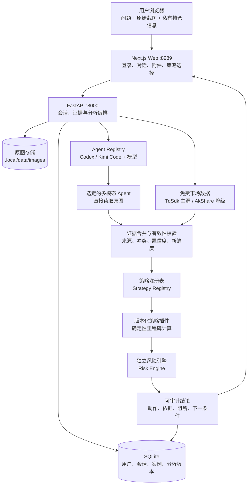

**中文** | [English](README.en.md)

# 磐石交易AI

面向中国期货市场的多模态、可审计策略分析系统。

## 产品定位

磐石交易AI是一套桌面端分析与决策支持系统。用户可以在持续对话中提交问题和完整
行情截图，系统自动完成：

- 可选择 Codex 或 Kimi Code 的原图多模态识别；
- TqSdk / AkShare 公开行情补全；
- 数据一致性与有效性校验；
- 版本化策略插件计算；
- 独立风险约束；
- 与策略步骤严格对齐的最终操作结论；
- 核心里程碑、证据来源和阻断原因展示；
- 对结论、步骤、证据和风险依据的持续追问。

系统不是让大语言模型“看图猜涨跌”，而是把多模态理解、公开数据、确定性策略、
独立风控和可审计交互组合成可信分析链路。

> **安全边界：** 当前版本只提供分析和决策支持。必须保持
> `TRADING_AGENT_ENABLE_ORDER_EXECUTION=false`，系统不连接实盘下单网关，
> 不能替代持牌投资顾问、交易所规则或用户自身的风险判断。

## 核心亮点

### 直接理解完整原图

运行时把用户上传的完整截图直接交给当前案例选定的 Codex 或 Kimi Code
多模态模型。生产证据链不使用
OpenCV、图像切片、本地 OCR 或坐标重建来替代模型理解，保留合约、周期、K 线、
指标和界面上下文。Codex 默认模型为 `gpt-5.6-sol`；Kimi Code 默认模型为
`kimi-k3`，界面显示为 `Kimi 3`。

Agent 与模型会固定到案例，图片识别、澄清理解和后续追问始终使用同一个选择。
系统不会静默回退到另一个 Agent；不可用时会展示具体原因，由用户明确切换。

### 自动补充公开数据

系统优先从截图、TqSdk、AkShare 和交易所盘后数据中补充行情、成交量、持仓量、
交易日期和指标输入。只有真实持仓、账户风险限制或截图目标冲突等私有事实才需要
用户通过对话补充。

### 最终动作由策略和风控决定

语言模型负责提取、归纳和解释证据，但**不能独立决定**最终操作。最终动作由
确定性策略插件和独立风险引擎生成，风险否决可以覆盖任何策略信号。

### 每个核心步骤都可以审计

每次分析保留策略 ID、版本、里程碑输入、规则比较、截图证据、公开行情证据、
字段来源、模型版本、置信度、阻断原因和下一触发条件。系统展示可验证的策略执行
记录，不展示模型隐藏思维过程。

### 策略与系统架构解耦

前端、会话、数据、认证和风控层不写死某一个策略。策略通过**策略注册表**加载并
固定到精确版本。当前默认插件是 `结构确认策略 v1.0.0`，后续策略可以独立安装、
升级、停用和回滚。

## 逻辑架构



### 组件职责

| 组件 | 职责 |
| --- | --- |
| Next.js Web | SQLite 账号登录、持续对话、截图附件、策略选择和历史记录 |
| FastAPI | API 鉴权、原图保存、案例状态、分析编排和会话管理 |
| SQLite | 保存用户密码哈希、会话摘要、案例事件和分析版本 |
| Agent Registry | 列出 Codex、Kimi Code 和模型能力，并把选择固定到案例 |
| Codex / Kimi Code | 直接读取原图，输出结构化观察、可见文字、置信度和不确定项 |
| TqSdk / AkShare | 补充中国期货公开行情；TqSdk 可选，AkShare 自动降级 |
| 证据层 | 合并截图与结构化行情，检测冲突、缺失、收盘状态和数据质量 |
| 策略注册表 | 发现、选择并固定策略插件版本 |
| 策略插件 | 按明确规则产生里程碑和候选动作 |
| 风险引擎 | 校验风险预算、止损距离和相关暴露，并执行风险否决 |
| 对话层 | 展示不可变策略输出，并回答后续解释性问题 |

### 从截图到结论

```text
用户问题与完整原图
  -> 选定 Codex 或 Kimi Code 及模型
  -> 选定 Agent 直接多模态抽取
  -> TqSdk / AkShare 自动补充公开行情
  -> 证据合并、来源追踪和数据有效性判断
  -> 选择并固定策略 ID 与版本
  -> 策略插件逐里程碑执行
  -> 独立风险引擎校验或否决
  -> 生成与每一步严格对齐的最终动作
  -> 保存分析版本并在同一对话中持续追问
```

## 默认部署模式

推荐使用不依赖 Docker 的本地轻量模式：

```text
Browser -> Next.js :8989 -> FastAPI :8000
                              |-> SQLite
                              |-> 原图目录
                              |-> Codex CLI / Kimi Code ACP
                              `-> 进程内策略分析
```

该模式只运行 Next.js 和 FastAPI 两个长期进程，不要求 PostgreSQL、Redis、MinIO、
Temporal、独立 Worker 或 OTel Collector。

## 安装

### 1. 环境要求

- macOS 或 Linux；
- Python 3.10 或更高版本；
- Node.js 20 或更高版本；
- npm、Git；
- 可执行的 Codex CLI；
- 可选的 Kimi Code CLI；
- 可通过环境变量传入的模型供应商 API Key；
- 空闲的本地端口 `8000` 和 `8989`。

检查基础命令：

```sh
python3 --version
node --version
npm --version
git --version
codex --version
kimi --version
```

### 2. 获取代码

公开仓库无需登录即可克隆：

```sh
git clone https://github.com/IFOSR/panshi-trading-ai.git
cd panshi-trading-ai
```

也可以使用 GitHub CLI：

```sh
gh repo clone IFOSR/panshi-trading-ai
cd panshi-trading-ai
```

### 3. 配置 Agent 与模型

Codex 是默认且优先的多模态提供方。初始化程序从当前 shell 读取
`CODE_CLI_API_KEY`：

```sh
export CODE_CLI_API_KEY=<your-code-cli-api-key>
codex --version
```

不要把真实 Key 写入 README、Git、`.env.example` 或启动脚本。初始化程序会把
凭据写入权限为 `0600` 的私有 `.local/env`。

如使用兼容供应商，在初始化后配置：

```sh
TRADING_AGENT_CODEX_MODEL_PROVIDER=code-cli
TRADING_AGENT_CODEX_PROVIDER_BASE_URL=https://your-provider.example/v1
TRADING_AGENT_CODEX_PROVIDER_ENV_KEY=CODE_CLI_API_KEY
CODE_CLI_API_KEY=<your-code-cli-api-key>
```

Codex 默认模型为 `gpt-5.6-sol`。Kimi Code 是可选 Agent，应用不会安装、升级或
改写 Kimi Code，也不会修改 `~/.kimi-code/config.toml`。如需启用 Kimi：

```sh
kimi --version
kimi doctor
```

Kimi Code 配置必须提供模型别名 `kimi-k3`，并在该模型的 capabilities 中声明
`image_in`。界面默认把它显示为 `Kimi 3`。系统也会列出
`kimi-code/kimi-for-coding`，但只有该别名同样声明 `image_in` 时才可用于截图
分析。模型还必须通过 ACP 初始化和会话创建，以验证现有认证可用。缺少 CLI、
模型别名、图片能力或 ACP 认证时，模型仍会显示，但处于禁用状态并说明原因。

Kimi 调用使用 `kimi -m <model> acp`，原图字节通过 ACP image block 发送；工具
权限一律拒绝。应用只读取现有 Kimi Code 登录态和模型配置，不升级或改写 Kimi Code。

### 4. 初始化

从仓库根目录执行：

```sh
./bin/trading-agent-local init
./bin/trading-agent-local doctor
```

`init` 会创建 Python 环境、安装依赖、构建前端、生成本地配置、初始化 SQLite，并
检查 Agent、模型和市场数据依赖。Codex 是必需项；Kimi Code 是可选项，未配置不会
阻止服务启动。主要本地文件如下：

```text
.local/env                         私有运行配置和服务密钥
.local/venv/                       Python 虚拟环境
.local/data/trading-agent.db       SQLite 数据库
.local/data/images/                用户原始截图
.local/logs/api.log                FastAPI 日志
.local/logs/web.log                Next.js 日志
.local/run/                        PID 和进程元数据
```

`.local` 已被 Git 忽略，不要把其中的内容提交到版本库。

### 5. 创建登录账号

账号和密码哈希保存在 SQLite，不写死在源码或环境变量中。先加载数据库地址：

```sh
set -a
. .local/env
set +a
```

交互式创建或修改账号密码：

```sh
.local/venv/bin/panshi-user set-password <username>
```

命令会隐藏读取两次密码。自动化环境可以从标准输入提供一次密码：

```sh
printf '%s\n' '<password>' \
  | .local/venv/bin/panshi-user set-password <username> --password-stdin
```

不要把真实密码写入命令行参数、`.local/env`、脚本或 Git。

### 6. 配置免费中国期货数据

本地模式默认使用：

```sh
TRADING_AGENT_MARKET_DATA_PROVIDER=free
```

- 配置免费快期账号后，TqSdk 作为主要行情源；
- 未配置 TqSdk 或请求失败时自动执行 **AkShare 降级**；
- 已收盘日线会在交易所日报可用时进行盘后校验；
- 数据源、校验来源和质量告警会显示在数据有效性步骤中。

启用 TqSdk 时编辑 `.local/env`：

```sh
TRADING_AGENT_TQSDK_USERNAME=<your-free-tq-account>
TRADING_AGENT_TQSDK_PASSWORD=<your-free-tq-password>
```

未配置时系统仍可通过 AkShare 运行。行情账号属于后端数据凭据，不会下发到浏览器。

### 7. 确认安全配置

`.local/env` 必须保留：

```sh
TRADING_AGENT_ENABLE_ORDER_EXECUTION=false
```

当前版本不要改为 `true`。

### 8. 启动服务

```sh
./trading-agent.sh start
```

启动后访问：

- Web：`http://127.0.0.1:8989`
- API 文档：`http://127.0.0.1:8000/docs`

检查状态：

```sh
./bin/trading-agent-local status
```

## 使用流程

1. 使用 SQLite 账号登录 Web。
2. 选择策略、Agent 和模型，输入分析问题。
3. 上传一至两张包含合约、周期和完整图表上下文的行情截图。
4. 系统直接使用选定 Agent 识别原图，并自动补充公开行情。
5. 页面展示数据有效性、策略里程碑、风险约束和最终动作。
6. 用户可以继续追问结论、步骤、证据或风险依据。
7. 只有公开数据和截图仍无法消除的真实歧义才通过对话澄清。
8. 新证据会生成新的分析版本，不修改原始结论。

## 日常操作

### 启停和状态

```sh
./trading-agent.sh start
./trading-agent.sh stop
./trading-agent.sh restart
./bin/trading-agent-local status
./bin/trading-agent-local doctor
```

### 用户管理

```sh
set -a
. .local/env
set +a

.local/venv/bin/panshi-user set-password <username>
.local/venv/bin/panshi-user disable <username>
.local/venv/bin/panshi-user enable <username>
```

- `set-password` 创建账号或轮换密码，并立即删除该用户的现有会话；
- `disable` 停用账号并立即删除全部会话；
- `enable` 重新启用账号，但不会恢复旧会话；
- 浏览器会话采用 **12 小时**绝对有效期；
- SQLite 只保存随机盐 scrypt 密码哈希和会话令牌摘要。

### 更新代码

```sh
./trading-agent.sh stop
git pull --ff-only
export CODE_CLI_API_KEY=<your-code-cli-api-key>
./bin/trading-agent-local init
./bin/trading-agent-local doctor
./trading-agent.sh start
```

## 故障排查

### Codex 不可用

```sh
codex --version
./bin/trading-agent-local doctor
```

确认当前 shell 已配置供应商凭据，并检查 `.local/env` 中的模型供应商字段。

### Kimi Code 或 Kimi 3 不可用

```sh
kimi --version
kimi doctor
./bin/trading-agent-local doctor
```

确认 `~/.kimi-code/config.toml` 中存在 `kimi-k3`，且 capabilities 包含
`image_in`。`kimi-code/kimi-for-coding` 同样需要 `image_in` 才会启用。应用
不会自动升级、修改配置或静默回退到 Codex；可以继续使用 Codex，或在修复 Kimi
配置后显式切换。

### Web 无法访问

```sh
./bin/trading-agent-local status
tail -n 100 .local/logs/web.log
```

确认 `8989` 端口未被占用且前端已经完成生产构建。

### API 启动失败

```sh
tail -n 100 .local/logs/api.log
./bin/trading-agent-local doctor
```

确认 `8000` 端口可用、SQLite 路径为绝对路径且 `.local/env` 权限正确。

### 登录后返回登录页

检查 API 状态、账号是否被停用以及会话是否超过 12 小时。必要时执行
`panshi-user set-password` 后重新登录。

### TqSdk 不可用

TqSdk 是可选源。检查账号配置后重启；未配置时应看到 **AkShare 降级**。如果所有
公开源都不可用，系统会明确阻断需要精确行情的策略步骤，而不是反复要求用户填写
可公开获取的数据。

## 开发与测试

后端：

```sh
python3 -m venv .venv
. .venv/bin/activate
pip install -e '.[dev]'
pytest -q
ruff check .
mypy src/trading_agent
```

前端：

```sh
cd web
npm ci
npm run lint
npm run build
npm run test:e2e
```

完整运行说明见 `docs/runbook.md`，多模态评估说明见 `docs/evaluation.md`。
